# TP2


## CREATE A VIRTUAL SERVER

-  Go to AWS
-  Open EC2

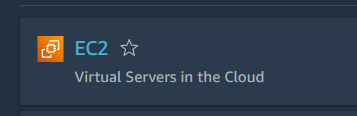

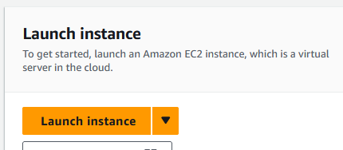

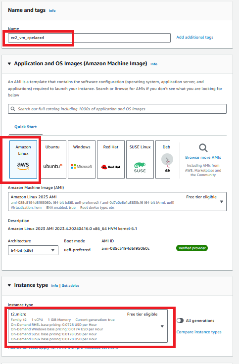

Create a key pair and save in your local machine

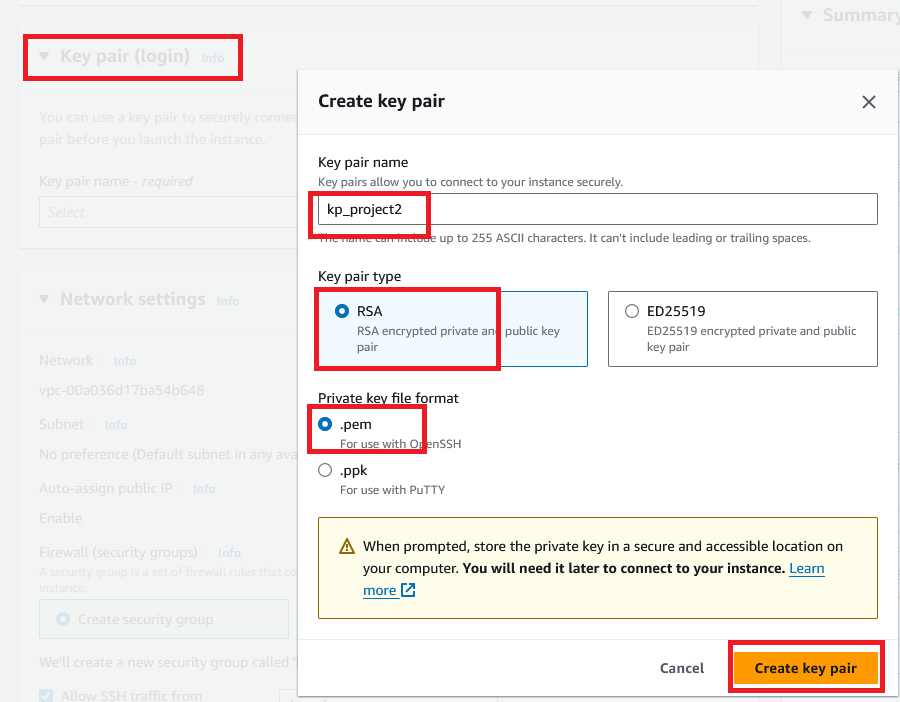

-  Network settings by default
-  Click on Launch instance

## CONNECT TO  VIRTUAL SERVER

-  Click on Instance/Connect button.
-  Open in your local machine powershell.
-  Go to the folde where you have your Keypair

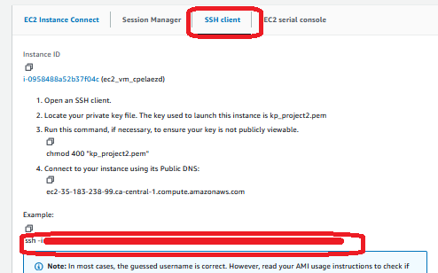

-  Connect to the machine

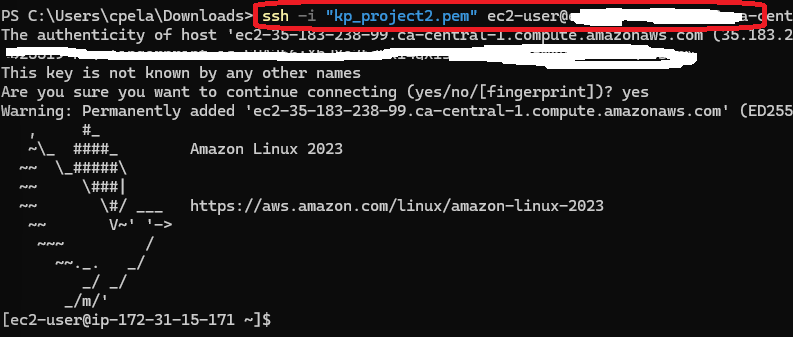


## KAFKA INSTALLATION

-  inside the virtual machine download kafka

```%powershell
wget https://downloads.apache.org/kafka/3.5.2/kafka_2.12-3.5.2.tgz
```

Uncompress file

```
tar -xvf kafka_2.12-3.5.2.tgz
```

Install java

```
sudo yum install java-1.8.0-amazon-corretto-devel -y
```

Move to kafka folder and start zookeper

```
$ cd kafka_2.12-3.5.2/
$ bin/zookeeper-server-start.sh config/zookeeper.properties
```

-  In powershell open another window and one new connection to the virtual machine to start kafka

```
$ export KAFKA_HEAP_OPTS="-Xmx256M -Xms128M"
$ cd kafka_2.12-3.5.2/
$ bin/kafka-server-start.sh config/server.properties
```

-  We need to user public IP instead private id.   Stop in both windows kafka to edit ip.

```
Ctrl+c
```

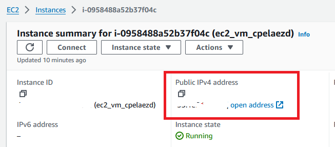

update config properties

```
$ sudo nano config/server.properties
```

Update the line below with the corresponding public IP.

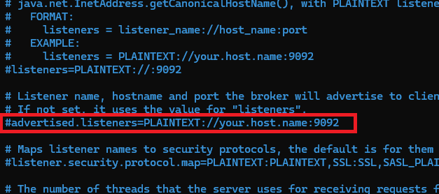

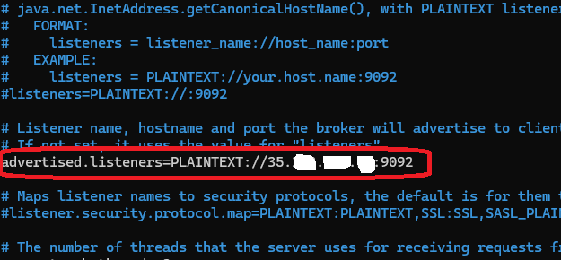


-  For the EC2 Instance, Go to the machine and click on Security.  
-  Select Security groups

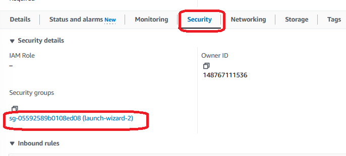

-  Click on Edit inbound rules button.
-  Add a new rule; Source Anywhere IPV4

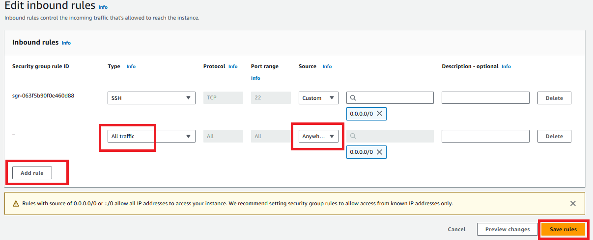

-  Open a third window in powershell to connect again to the machine.  In this machine execute these commands

```
$ cd kafka_2.12-3.5.2/
```

-  Create the topic


```
$ bin/kafka-topics.sh --create --topic project_streaming --bootstrap-server {replace this text with your Public IP of your EC2 Instance:9092} --replication-factor 1 --partitions 1

```

-  Start Producer

```
$ bin/kafka-console-producer.sh --topic project_streaming --bootstrap-server {Put the Public IP of your EC2 Instance:9092} 
```

-  Open a fourth window , open a new EC2 session.  
-  Copy in the fourth windows the command to start de Consumer

```
$ cd kafka_2.12-3.5.2/
$ bin/kafka-console-consumer.sh --topic project_streaming --bootstrap-server {Put the Public IP of your EC2 Instance:9092}
```

-  Test Producer and verify in consumer window. 

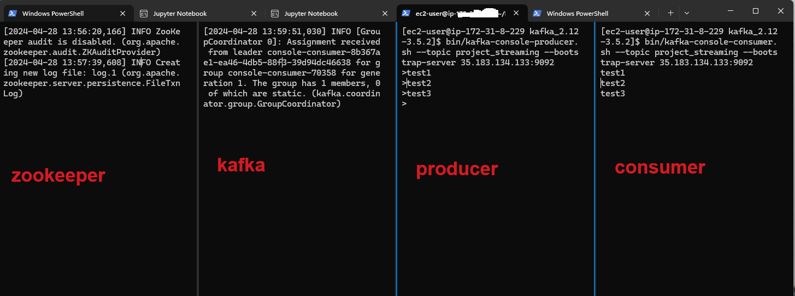

