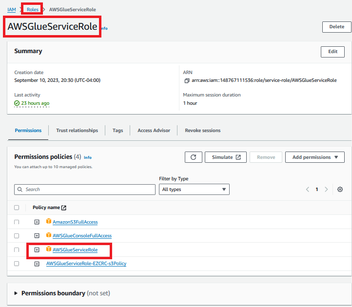
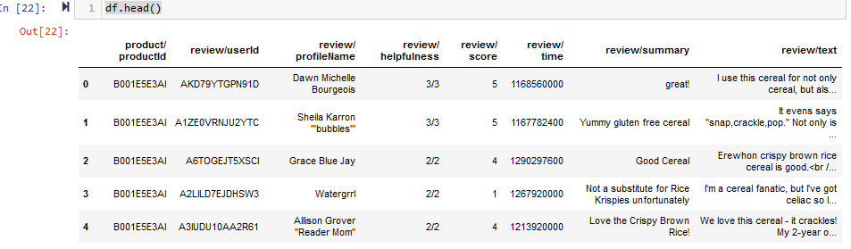

# TP2

references:  
```
https://www.youtube.com/watch?v=KerNf0NANMo
```

## ARQUITECTURE


## AWS - EC2 - CREATE A VIRTUAL SERVER

-  Go to AWS
-  Open EC2


Create a key pair and save in your local machine


-  Network settings by default
-  Click on Launch instance


### Allow all trafic
-  For the EC2 Instance, Go to the machine and click on Security.  
-  Select Security groups


-  Click on Edit inbound rules button.
-  Add a new rule; Source Anywhere IPV4


## AWS - IAM CREATE USER


-  Download csv file


-  Create a Key access from new user necesary to  configure the AWS Command Line Interface (CLI) (Open powershell)


-  Open Powershell and configure aws KeyID and Access Key


## AWS - IAM CREATE AN AWS GLUE SERVICE ROLE

-  That is important to access to the catalogue.



## AWS - S3 - CREATE BUCKETS
-  Create two bucket one to store date files from consumer and the other one to store results from Athena querys.  


-  Same steps as previous on.  This bucket is to work with Athena


## AWS - EC2 - CONNECT TO  VIRTUAL SERVER

-  Click on Instance/Connect button.
-  Open in your local machine powershell.
-  Go to the folde where you have your Keypair


-  Connect to the machine


## EC2 - CONFIGURATION KAFKA INSTALLATION

-  inside the virtual machine download kafka

```%powershell
wget https://downloads.apache.org/kafka/3.5.2/kafka_2.12-3.5.2.tgz
```

Uncompress file

```
tar -xvf kafka_2.12-3.5.2.tgz
```

Install java

```
sudo yum install java-1.8.0-amazon-corretto-devel -y
```


### CONFIGURE KAFKA WITH PUBLIC IP
-  We need to use a public IP instead private id.   


update config properties

```
$ cd kafka_2.12-3.5.2/
$ sudo nano config/server.properties
```

Update the line below with the corresponding public IP.


Move to kafka folder and start zookeper

```
$ cd kafka_2.12-3.5.2/
$ bin/zookeeper-server-start.sh config/zookeeper.properties
```


-  In powershell open another window and one new connection to the virtual machine to start kafka

```
$ export KAFKA_HEAP_OPTS="-Xmx256M -Xms128M"
$ cd kafka_2.12-3.5.2/
$ bin/kafka-server-start.sh config/server.properties
```


-  Open a third window in powershell to connect again to the machine.  In this machine execute these commands

```
$ cd kafka_2.12-3.5.2/
```

-  Create the topic


```
$ bin/kafka-topics.sh --create --topic project_streaming --bootstrap-server IP.IP.IP.IP:9092 --replication-factor 1 --partitions 1

```

-  Start Producer

```
$ bin/kafka-console-producer.sh --topic project_streaming --bootstrap-server IP.IP.IP.IP:9092 
```

-  Open a fourth window , open a new EC2 session.  
-  Copy in the fourth windows the command to start de Consumer

```
$ cd kafka_2.12-3.5.2/
$ bin/kafka-console-consumer.sh --topic project_streaming --bootstrap-server IP.IP.IP.IP:9092
```

-  Test Producer and verify in consumer window. 


## JUPYTER NOTEBOOK - PYTHON CODE

-  Open Jupyter framework
-  Create a Python file kafka producer and kafkaconsumer.
-  In kafka producer install kafka-python.

```shell
pip install kafka-python
pip install s3fs
```

### KAFKA PRODUCER CODE
-  In kafkaproducer install these libraries. 

```python
import pandas as pd
from kafka import KafkaConsumer, KafkaProducer
from time import sleep
from json import dumps
import json
```

-  Read data from JSON file in local machine and display preliminar data
```python
df = pd.read_json("D:\\BIGDATA\\420_D07_BB_DEVELOPPEMENT_DE_TRAITEMENTS_DISTRIBUES\\projet\\project_streaming\\foodsAzure.json")
df.head()
```


-  With Pandas library implement some modifications in data frame.

```python
#Delete columns non necessary from the analysis
df = df.drop('review/text', axis=1)
df = df.drop('review/helpfulness',axis=1)

#modify columns names
df = df.rename(columns={'product/productId': 'productId', 
                        'review/userId': 'userId',
                        'review/profileName': 'profileName',
                        'review/score': 'score',
                        'review/time': 'date_review',
                        'review/summary': 'summary'})

#transform date from linux format to datetime format and next convert to string type
df['date_review'] = pd.to_datetime(df['date_review'], unit='s')
df['date_review'] = df['date_review'].astype(str)

#display
df.head()
```


-  Create de producer with the corresponding public IP

```python
producer = KafkaProducer(bootstrap_servers=['IP.IP.IP.IP:9092'],
                         value_serializer=lambda x:
                         dumps(x).encode('utf-8'))
```

-  Producer begins to send information to producer,  sleep to simulate the streaming
-  project_streaming is the topic name
```python
while True:
    dict_review = df.sample(1).to_dict(orient='records')[0]
    producer.send('project_streaming', value=dict_review)
    sleep(5)
```


### KAFKA CONSUMER CODE
-  in kafkaconsumer file import these libraries

```python
from kafka import KafkaConsumer
from time import sleep
from json import dumps,loads
import json
import s3fs
```

-  Create a Kafka Consumer

```python
consumer = KafkaConsumer(
    'project_streaming',
    bootstrap_servers=['IP.IP.IP.IP:9092'],
                         value_deserializer=lambda x: loads(x.decode('utf-8')))
```

-  Create object s3fs
```python
# We need to add CLI information relative to the AWS user.  
s3 = s3fs.S3FileSystem(anon=False)  # Utilisez vos informations d'identification
```

-  Begin to create json files with information consumer gets and send it  to s3 bucket
```python
for count, i in enumerate(consumer):
    with s3.open("s3://s3-bucket-amazonreview/amazon_reviews_{}.json".format(count),'w') as file:
                 json.dump(i.value,file)
```    

-  Verify that aws bucket get the corresponding json files from kafka


## AWS - CRAWLERS

-  Create a new crawler


-  You need to select or create a IAM glue role (previously created)


-  Select or create a database


-  Run crawler to get the schema of json files in the bucket and wait until status becomes completed


## AWS - GLUE
-  Verify Catalog


###  AWS - ATHENA
-  Open Athena and execute some querys.  


